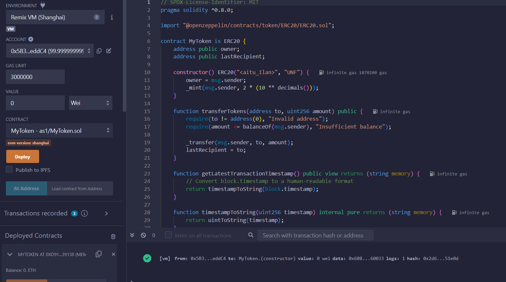
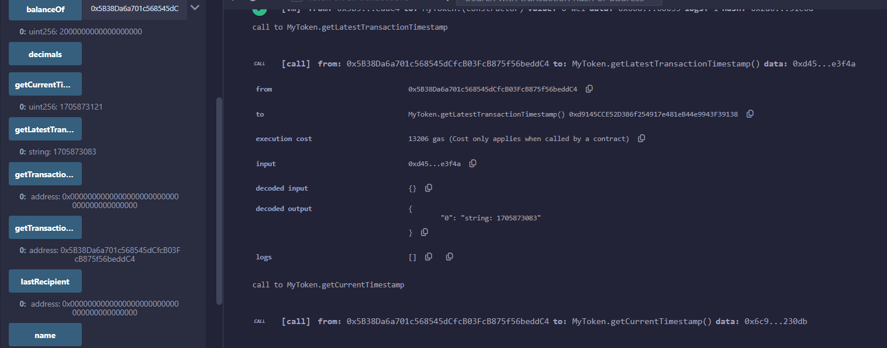
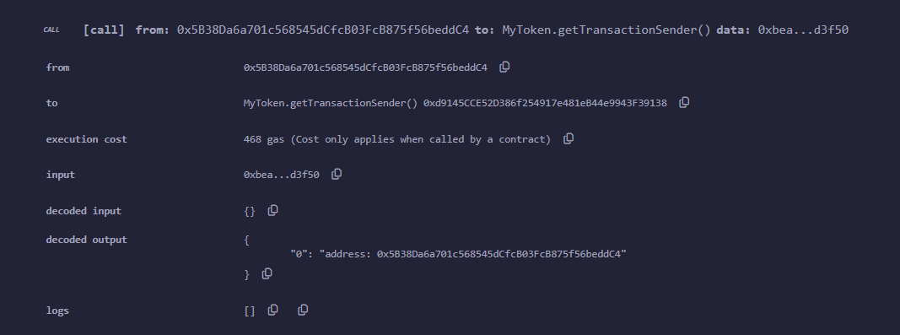
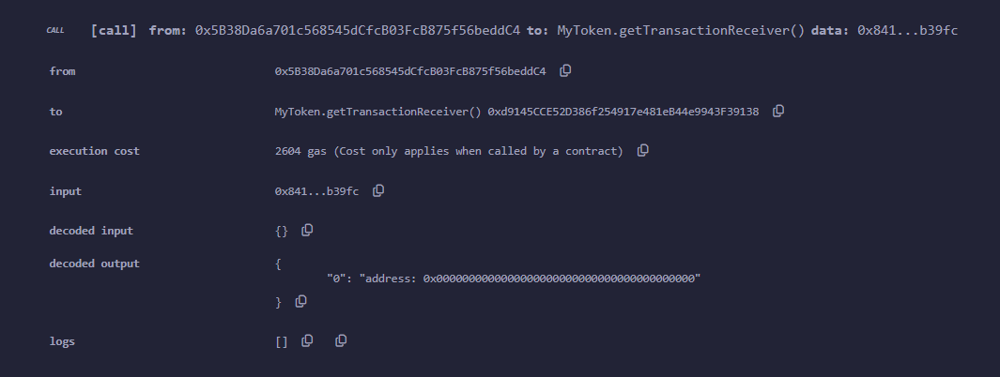

# <aitu_Ilan> Token

## Overview
This is an ERC-20 token contract created for the project by "Blockchain Technologies" subject.

## Usage

### Interacting with the Contract
- **getLatestTransactionTimestamp:** Returns the block timestamp of the latest transaction in a human-readable format.
- **getTransactionSender:** Returns the address of the transaction sender.
- **getTransactionReceiver:** Returns the address of the last transaction receiver.

### Examples
Here are some examples of how to interact with the contract in Remix:

#### Deploying the Contract

#### Calling `getLatestTransactionTimestamp`

#### Calling `getTransactionSender`

#### Calling `getTransactionReceiver`

